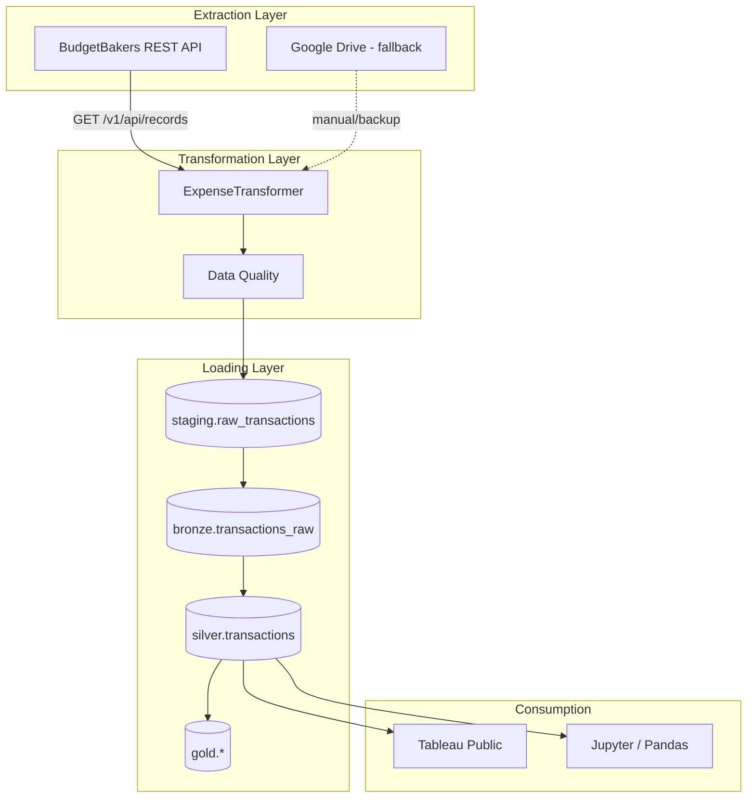

# Personal Finance Pipeline - Architecture & Next Steps

## Executive Summary

Your foundation is strong: medallion architecture, robust `ExpenseTransformer`, content-based deduplication, and PostgreSQL as the warehouse. The initial load works. The main gaps are **extraction automation**, **incremental loading**, and **orchestration**. This plan prioritizes BudgetBakers API (you have Premium), then incremental load, then scheduling.

---

## Current State Assessment

### What Works Well


| Component                  | Assessment                                                                  |
| -------------------------- | --------------------------------------------------------------------------- |
| **Medallion architecture** | Staging → Bronze → Silver → Gold is industry-standard; your design is sound |
| **ExpenseTransformer**     | 9-step pipeline with date parsing, EUR conversion, hashing, derived fields  |
| **Deduplication**          | SHA-256 hash on date+amount+subcategory+description is reliable             |
| **PostgreSQL**             | ACID, Tableau-friendly, good for financial data                             |
| **Category hierarchy**     | `silver.category_mapping` for subcategory→category→classification           |


### Gaps and Issues

1. **Extraction**: Manual export from app → download → place in `data/raw/` — no automation
2. **Incremental load**: Only `initial_load.py` exists; it truncates silver (correct for first run, wrong for updates)
3. **Orchestration**: No `run_pipeline.py` or scheduler
4. **Code quality**: Hardcoded paths (`C:\Users\teodo\Downloads\`), debug `to_csv` in production code
5. **MinIO**: Present in docker-compose but unused (you noted you don't need it now)
6. **Column mapping**: Transformer outputs `payment_method`; initial_load staging expects `payment_type` — verify alignment with your actual export schema

---

## Target Architecture




---

## Phase 1: BudgetBakers API Extractor (High Priority)

**Goal**: Replace manual CSV/Excel export with automated API extraction.

### API Details (from [Wallet API Reference](https://rest.budgetbakers.com/wallet/reference))

- **Endpoint**: `GET https://rest.budgetbakers.com/wallet/v1/api/records`
- **Auth**: `Authorization: Bearer <api_token>` (from [web.budgetbakers.com/settings/apiTokens](https://web.budgetbakers.com/settings/apiTokens))
- **Pagination**: `limit=200` (max), `offset` for next page
- **Date filter**: `recordDate=gte.2024-01-01&recordDate=lt.2025-01-01` (max 370 days per request)
- **Rate limit**: 500 req/hour

### Record Schema Mapping (API → Your Schema)


| API Field                         | Your Field                               |
| --------------------------------- | ---------------------------------------- |
| `recordDate`                      | `date`                                   |
| `note`                            | `description`                            |
| `recordType` (income/expense)     | `type`                                   |
| `payee` / `payer`                 | `payee`                                  |
| `amount.value` (negative=expense) | `amount`                                 |
| `amount.currencyCode`             | `currency`                               |
| `category.name`                   | `subcategory`                            |
| `paymentType`                     | `payment_type`                           |
| `accountId`                       | resolve via `/accounts` → `account_name` |


### Implementation

Create `[src/extractors/budgetbakers_extractor.py](src/extractors/budgetbakers_extractor.py)`:

- Fetch records in date-range chunks (e.g., 365 days) with pagination
- Handle 409 Conflict (initial sync) with retry
- Map API `Record` objects to DataFrame matching `ExpenseTransformer` input
- Resolve `accountId` → account name via `/v1/api/accounts`
- Store `record.id` in bronze for lineage (enables future incremental by `updatedAt`)

**Config**: Add `BUDGETBAKERS_API_TOKEN` to `.env` (never commit).

---

## Phase 2: Incremental Load Script

**Goal**: Load only new transactions without truncating silver.

### Logic

1. **Extract**: From API (or file) for date range `last_silver_date + 1` → `today`
2. **Transform**: Same `ExpenseTransformer` (idempotent)
3. **Load Bronze**: Append all (immutable)
4. **Load Silver**: `INSERT ... WHERE transaction_hash NOT IN (SELECT transaction_hash FROM silver.transactions)`
5. **Log**: `metadata.pipeline_runs` with `rows_skipped_duplicates`

### Key Code Pattern

```python
# Get max date in silver
max_date = conn.execute("SELECT MAX(transaction_date) FROM silver.transactions").scalar()

# Extract from API: recordDate >= max_date + 1 day
# Transform, then INSERT only new hashes
```

Create `[src/loaders/incremental_load.py](src/loaders/incremental_load.py)` that:

- Reuses `ExpenseTransformer` and `_bulk_insert`
- Does NOT truncate silver
- Uses `ON CONFLICT (transaction_hash) DO NOTHING` or pre-filter by hash
- Updates `silver.category_mapping` join for new rows (or run same UPDATE as initial_load)

---

## Phase 3: Unified Pipeline Entry Point

**Goal**: Single command to run full or incremental pipeline.

Create `[scripts/run_pipeline.py](scripts/run_pipeline.py)`:

```python
# Pseudo-code
if args.mode == "full":
    extractor = BudgetBakersExtractor(date_from=args.from_date, date_to=args.to_date)
    df = extractor.extract()
elif args.mode == "incremental":
    df = extract_from_api_or_file(incremental=True)
else:
    df = extract_from_file(args.file)  # fallback: manual file

df = ExpenseTransformer().transform(df)
load_to_bronze(df)
load_to_silver(df, incremental=(args.mode == "incremental"))
```

Support both API and file-based extraction for flexibility.

---

## Phase 4: Orchestration (Prefect)

**Recommendation**: **Prefect** over Airflow for a personal project — Python-native, less infra, good for dynamic pipelines.

### Setup

1. `pip install prefect`
2. Create `flows/expense_pipeline_flow.py`:

```python
from prefect import flow, task

@task
def extract_from_budgetbakers():
    ...

@task
def transform(df):
    ...

@flow
def expense_pipeline_flow(mode: str = "incremental"):
    df = extract_from_budgetbakers(mode=mode)
    transformed = transform(df)
    load_to_postgres(transformed, incremental=(mode == "incremental"))
```

1. Schedule: `prefect deployment build flows/expense_pipeline_flow.py:expense_pipeline_flow --cron "0 6 * * *"` (daily 6 AM)
2. Run: `prefect agent start` (or Prefect Cloud for managed scheduling)

**Alternative**: Simple `cron`/Task Scheduler calling `python scripts/run_pipeline.py --mode incremental` daily — zero extra dependencies.

---

## Phase 5: Google Drive Fallback (Optional)

If you want a backup path when API is unavailable:

- Use **Google Drive API** (`google-api-python-client`) to list files in `Finance/Wallet_Exports/`
- Download newest `.xlsx`/`.csv` by `modifiedTime`
- Pass to same transform/load pipeline

Uncomment and configure the Google Drive deps in `[requirements.txt](requirements.txt)`. Lower priority if API is primary.

---

## Phase 6: Cleanup and Hardening


| Item             | Action                                                                                                        |
| ---------------- | ------------------------------------------------------------------------------------------------------------- |
| Hardcoded paths  | Use `Path(__file__).parent` or config; move output to `data/processed/` or env var                            |
| Debug `to_csv`   | Remove `df.head(100).to_csv(...)` from `[initial_load.py](src/loaders/initial_load.py)`                       |
| Column alignment | Confirm raw export uses `payment` or `payment_type`; align transformer and loaders                            |
| MinIO            | Remove from docker-compose if not needed, or document as future archive                                       |
| Init scripts     | Add `init_scripts/01_create_tables.sql` from `[architecture_doc.md](architecture_doc.md)` for reproducibility |


---

## Technology Stack Summary


| Layer         | Technology                              | Rationale                      |
| ------------- | --------------------------------------- | ------------------------------ |
| Extract       | BudgetBakers API, optional Google Drive | Automated, no manual export    |
| Transform     | Python + Pandas (`ExpenseTransformer`)  | Already built, well-structured |
| Load          | PostgreSQL 17, psycopg2                 | ACID, Tableau-ready            |
| Orchestration | Prefect or cron                         | Lightweight, Python-native     |
| Consumption   | Tableau Public, Jupyter                 | As-is                          |
| Storage       | PostgreSQL only (MinIO optional)        | Simpler                        |


---

## Recommended Implementation Order

1. **BudgetBakers API extractor** — biggest automation win
2. **Incremental load** — enables daily updates
3. **run_pipeline.py** — unified entry point
4. **Prefect or cron** — scheduled runs
5. **Cleanup** — paths, debug code, column alignment
6. **Google Drive** — only if desired as fallback

---

## Open-Source Tools Referenced

- **Prefect** (Apache 2.0) — workflow orchestration
- **BudgetBakers Wallet API** — official REST API
- **Google Drive API** — file download
- **PostgreSQL** — database
- **Pandas** — transformation
- **Tableau Public** — visualization

---

## Questions for You

1. **EUR conversion rates**: Currently hardcoded in `ExpenseTransformer.EUR_RATES`. Consider fetching live rates (e.g., [exchangerate.host](https://exchangerate.host) free tier) or storing in a config table?
2. **Gold tables**: Architecture doc defines `gold.monthly_category_summary` and `gold.account_balance_history`. Are these created and refreshed? If not, add materialized views or batch jobs.
3. **Tableau view**: `silver.v_tableau_transactions` — ensure it exists and includes all needed columns for your dashboards.

