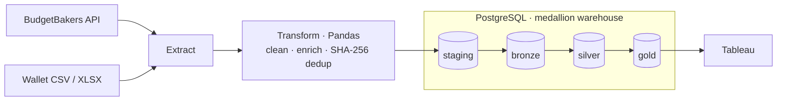

# Personal Finance Pipeline

A self-hosted, automated ETL pipeline that turns personal expense and income data from the Wallet (BudgetBakers) app into a structured, analytics-ready data warehouse in PostgreSQL — with gold-layer intelligence and Tableau visualization.

**What this demonstrates:** a genuine medallion data warehouse (`staging → bronze → silver → gold`) with content-hash deduplication and an idempotent, safely re-runnable pipeline; two custom gold scoring models that flag *unusual* spending and *avoidable* spending at the individual-transaction level; and production-minded engineering — an audit-trail trigger, a checksummed migration runner, automated offsite backups, Docker-packaged runs, and a CI-tested codebase. Built to run for decades, not a weekend.

<!--
  Dashboard preview — enable once the anonymized dashboard is published to Tableau Public.
  Save the screenshot as docs/images/dashboard.png and provide the published viz URL below.
  See docs/images/README.md for the specification and the anonymized-data requirement.

[](https://public.tableau.com/app/profile/YOUR_PROFILE/viz/YOUR_VIZ)
-->

---

## What This Project Does

1. **Extracts** expense and income data from BudgetBakers (REST API or CSV/XLSX export).
2. **Transforms** it through a 9-step cleaning pipeline (date parsing, currency conversion, deduplication via SHA-256 hash, derived fields).
3. **Loads** it into PostgreSQL following a **medallion architecture**: staging -> bronze -> silver -> gold.
4. **Scores** every expense transaction for **notability** (how surprising?) and **save potential** (could I have avoided this?).
5. **Visualized** in Tableau, connecting directly to silver and gold tables.

---

## Architecture



### Technology Stack

| Layer | Technology |
|-------|-----------|
| Data Warehouse | PostgreSQL 17 (Docker) |
| Extraction | BudgetBakers REST API (Premium) or file export |
| Transformation | Python 3.11+ with Pandas |
| Visualization | Tableau Public |
| Infrastructure | Docker Compose (Postgres + containerized pipeline) |

### Database Layers (Medallion Architecture)

| Schema | Purpose |
|--------|---------|
| `staging` | Temporary landing area, truncated each run |
| `bronze` | Raw data as received, append-only immutable archive |
| `silver` | Cleaned, deduplicated, and enriched -- main analytics layer |
| `gold` | Pre-computed transaction-level intelligence (notability, save potential) |
| `metadata` | Pipeline run logs, schema-migration tracking, and the silver audit trail |

### Key Features

- BudgetBakers API extraction (automated, no manual export needed)
- Incremental loading (only new transactions inserted via hash deduplication)
- Idempotent pipeline (safe to re-run without duplicates)
- Data quality validation (date parsing, null checks, row-count sanity)
- Gold-layer analytics computed automatically on each load
- Comprehensive pipeline logging to `metadata.pipeline_runs`

---

## Gold Layer: Transaction Intelligence

Two gold tables sit on top of silver and score every EXPENSE transaction at the `transaction_hash` level.

### Transaction Notability (`gold.transaction_notability`)

Answers: **"What's surprising this month?"**

Each transaction is scored by how unusual its amount is compared to the same subcategory over the prior 365 days (rolling z-score). Flags include:

- **New Category** -- first time spending in a subcategory
- **New Record** -- largest-ever transaction in a subcategory
- **Extreme / High Outlier** -- z-score >= 2 or 3 standard deviations above average
- **Insufficient History** -- not enough data to compute a meaningful z-score

### Transaction Save Potential (`gold.transaction_save_potential`)

Answers: **"Where could I have saved money?"**

Three signals combined into a weighted composite score:

| Signal | Weight | What it measures |
|--------|--------|-----------------|
| **Avoidability** (classification) | x3 (dominant) | WANT = 1.0, NEED = 0.4, MUST = 0.05 |
| **Frequency excess** | x2 | This month's transaction count vs. average monthly count in the subcategory (365-day lookback) |
| **Amount excess** | x1 | Positive z-score (same rolling window as notability), capped |

Labels: High Save Potential (>= 5), Medium (>= 3), Low (>= 1), Minimal (< 1).

Both gold tables refresh **automatically** after each pipeline load (incremental for new hashes, full on initial load). Manual full rebuilds are available via standalone scripts.

---

## Quick Start

### Prerequisites

- Docker & Docker Compose installed
- Python 3.11+
- BudgetBakers Wallet Premium + API token (from web.budgetbakers.com/settings/apiTokens) or extract .csv/.xlsx from the App
- Any data visualization tool. I have used Tableau Public Desktop or Tableau Desktop.

### Setup

1. Copy `.env.example` to `.env` and fill in your credentials (Postgres + `BUDGETBAKERS_API_TOKEN`).
2. Start PostgreSQL: `docker compose up -d postgres`
3. Install deps (only needed for host-based Python runs — the Docker path doesn't need this): `pip install -r requirements.txt`
4. Create the schema. The entire warehouse — all five schemas, every table and
   index, and the silver audit trigger — is defined in a single file you can run
   once against an empty database:
   ```bash
   psql -U $POSTGRES_USER -d finance_warehouse -f docs/postgres_init_blueprint.sql
   ```
   This is the canonical, sanitized schema of record. (The owner's live instance
   is built from private numbered scripts under `scripts/sql/`, which carry
   owner-specific seed data and grants and are not part of the public repo — the
   blueprint stays in sync with them.)

---

## Run with Docker (recommended)

The pipeline is packaged as a one-shot container built from `docker/Dockerfile`. Postgres runs alongside it as a long-lived service. This is the reproducible path — it works identically on any machine with Docker, without depending on the host's Python version or virtualenv.

### First-time setup on a new machine

```bash
docker compose build pipeline
docker compose up -d postgres
# Create the schema once — see Setup step 4 (applies docs/postgres_init_blueprint.sql).
# Then run an initial full load from the BudgetBakers API:
docker compose run --rm pipeline python scripts/run_pipeline.py --mode full --source api
```

Other ways to seed the warehouse on the first run:

- **From a file export** — `run_pipeline.py --mode full --source file --file data/raw/full_export.xlsx`
- **From a backup** — restore a `pg_dump` produced by `scripts/backup.ps1` (see `docs/04_RUNBOOK.md`); this is the recovery / machine-migration path.

> **Forking this repo?** `docker compose up -d postgres` auto-runs the owner's
> private init scripts, which aren't in the public repo — build the schema from
> the blueprint instead (Setup step 4). It's complete and standalone.

### Daily incremental run

```bash
docker compose run --rm pipeline python scripts/run_pipeline.py --mode incremental
```

### Other useful commands

```bash
# Dry-run inspection (no writes)
docker compose run --rm pipeline python scripts/inspect_incremental_load.py

# Tests inside the container
docker compose run --rm pipeline python -m pytest tests/ -v

# Open a shell in the container for debugging
docker compose run --rm pipeline /bin/bash
```

### Schema migrations

Schema changes after initial setup are applied with `scripts/migrate.py`, a
small checksummed migration runner (`--status`, `--dry-run`, `--baseline`).
It's only needed when the schema evolves — not for routine pipeline runs.

The container bind-mounts `./data`, `./logs`, and `./backups` from the host, so files you drop into `data/raw/` on the host are immediately visible inside the container, and any output written to those paths persists on the host.

### Host-based Python still works

Running the pipeline directly on the host (against the containerized Postgres) is still fully supported and is the faster iteration path during development:

```bash
docker compose up -d postgres
python scripts/run_pipeline.py --mode incremental
```

The `.env` file has `POSTGRES_HOST=localhost` (for host-Python → mapped 5432). Inside the pipeline container, `docker-compose.yml` overrides this to `POSTGRES_HOST=postgres` (the service name).

---

## Run Pipeline

All pipeline runs go through a single entry point: `scripts/run_pipeline.py`.

### Normal Incremental Run (most common)

Pull new transactions from the API starting from the day after the last silver record through today. This is the run you'd schedule daily or weekly.

```bash
python scripts/run_pipeline.py --mode incremental
```

This automatically:
- Extracts from the BudgetBakers API (default source)
- Transforms, deduplicates, and loads to staging -> bronze -> silver
- Refreshes gold notability + save potential for the new expense hashes

### Incremental with Explicit Date Range

Override the automatic watermark when you know exactly which days to pull:

```bash
python scripts/run_pipeline.py --mode incremental --from-date 2026-03-25 --to-date 2026-04-04
```

### Incremental from a File

Load a CSV or XLSX export instead of hitting the API. Only new rows (by hash) are appended to silver:

```bash
python scripts/run_pipeline.py --mode incremental --source file --file data/raw/export.xlsx
```

### Incremental with Account Filter

Filter to specific account presets during load:

```bash
python scripts/run_pipeline.py --mode incremental --account-filter bgn_final
python scripts/run_pipeline.py --mode incremental --account-filter eur       # default
```

### Full Load from File (Initial Setup or Rebuild)

Truncates silver and reloads everything from a file. Use for first-time setup or when you want to rebuild from a clean export:

```bash
python scripts/run_pipeline.py --mode full --source file --file data/raw/full_export.xlsx
```

### Full Load from API (Date Range)

Pull a date range from the API and do a full (truncate + reload) silver load:

```bash
python scripts/run_pipeline.py --mode full --source api --from-date 2024-01-01 --to-date 2026-04-01
```

### Manual Gold Refresh (Standalone)

After correcting silver data, remapping categories, or changing classification values, rebuild all gold scores from scratch:

```bash
python scripts/run_pipeline.py --refresh-gold notability
python scripts/run_pipeline.py --refresh-gold save-potential
python scripts/run_pipeline.py --refresh-gold both
```

These are **not needed** for normal pipeline runs -- gold refreshes automatically.

---

## Orchestration (planned)

Today the pipeline is triggered manually (or via OS schedulers — cron / Windows
Task Scheduler). Scheduled, observable runs via **Prefect** are on the roadmap; a
flow prototype lives in `flows/expense_pipeline_flow.py`. Prefect is intentionally
left out of `requirements.txt` until it's wired in, so the install stays lean.

---

## Run Tests

```bash
python -m pytest tests/ -v
```

---

## Tableau

- Connect to `silver.transactions` for the analytics base
- Join `gold.transaction_notability` and `gold.transaction_save_potential` on `transaction_hash` to bring in the scoring columns
- Load your data into the sample dashboard, or build your own views on top of these tables
- Refresh the extract after each pipeline run

---

## Project Layout

```
docker/                     Dockerfile and container entrypoint script
scripts/
  run_pipeline.py             unified pipeline runner (full, incremental, gold-only refresh)
  migrate.py                  DIY migration runner (apply / status / dry-run / baseline)
  backup.ps1                  Weekly pg_dump + rclone offsite backup to Google Drive
  anonymization_finance_data.py  Anonymized CSV export for Tableau Public
  inspect_incremental_load.py dry-run inspection (no writes)
  sql/init/                   Schema DDL — runs automatically on first Postgres container init (owner's private files)
  sql/migrations/             Post-init schema migrations (owner's private files)
src/
  extractors/               BudgetBakers API + file extraction
  transformers/             Pandas transformation logic
    expense_transformer.py    9-step cleaning pipeline
    notable_transactions_transformer.py   z-score + notability scoring
    save_potential_transformer.py         avoidability + frequency + amount scoring
  loaders/                  PostgreSQL loading (initial, incremental, gold upserts)
  utils/                    DB connection helper, SHA-256 hash generator
tests/                      Unit tests for transformers
docs/                       Architecture, data contracts, scoring model specs, runbook
```

---

## Project History

| Date | Milestone |
|------|-----------|
| Jun 2025 | Project initialized, local environment setup |
| Jul 2025 | PostgreSQL + MinIO Docker infrastructure |
| Nov 2025 | Phase 2: simplified pipeline, BudgetBakers API extraction |
| Mar 2026 | Initial + incremental loaders, silver layer complete |
| Apr 2026 | Gold layer: transaction notability (z-score) + save potential scoring |
| May 2026 | Audit trail trigger, DIY migration runner, Docker containerization, automated backup to Google Drive — Phase A complete |
